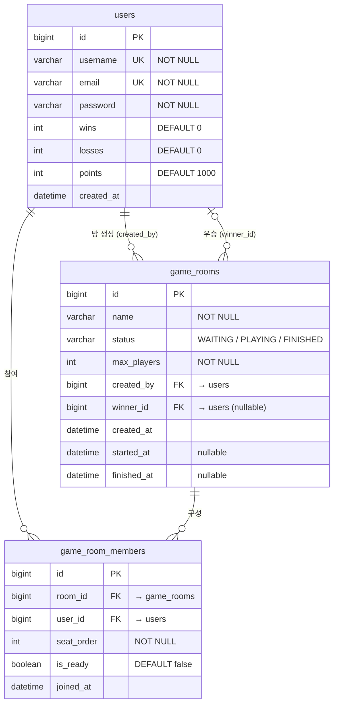
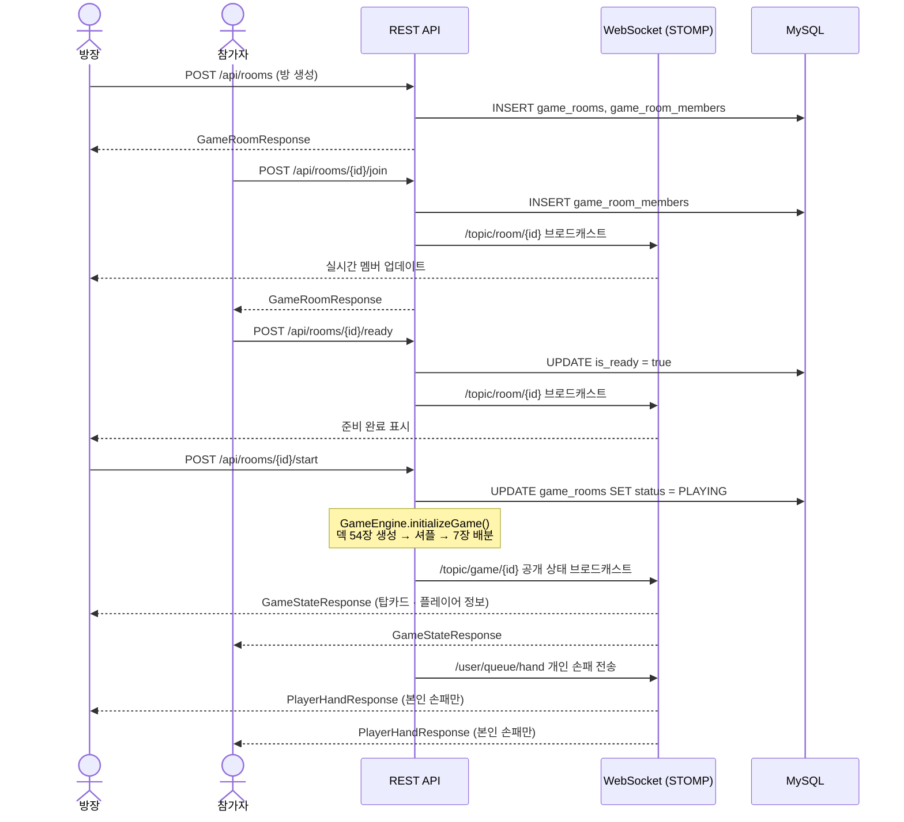
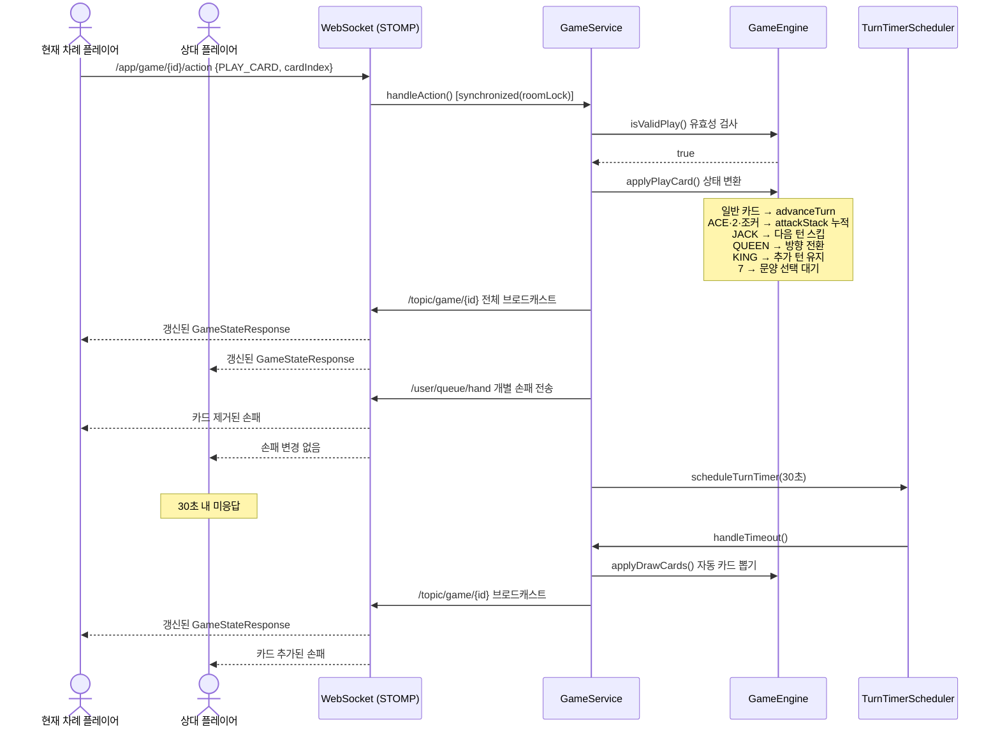
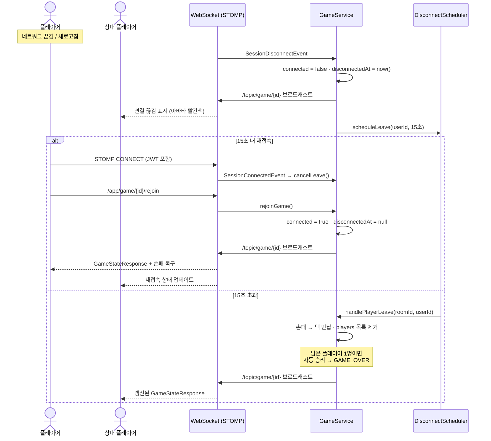

# OneCard - 실시간 멀티플레이어 원카드 게임

WebSocket(STOMP)을 활용한 실시간 2~4인 원카드 카드 게임 서비스

---

## 기술 스택

| 구분 | 기술 |
|---|---|
| **Backend** | Java 21, Spring Boot 3, Spring Security, Spring WebSocket (STOMP/SockJS), JPA/Hibernate |
| **Frontend** | React 18, TypeScript, Vite, Zustand, STOMP.js, TailwindCSS |
| **DB** | MySQL 8.0, Redis 7 |
| **Infra** | Docker, Docker Compose, Nginx |

---

## 주요 기능

- **실시간 멀티플레이** — WebSocket STOMP 기반 2~4인 동시 플레이
- **게임 룰 완전 구현** — ACE/2/조커(공격), JACK(스킵), QUEEN(방향 전환), KING(추가 턴), 7(문양 변경)
- **손패 은닉** — 공개 채널(`/topic`)과 개인 채널(`/user/queue`) 분리로 타인 손패 노출 차단
- **접속 끊김 유예** — 게임 중 15초, 대기방 3초 재접속 유예 후 자동 퇴장 처리
- **턴 타임아웃** — 30초 내 미응답 시 자동 카드 드로우
- **포인트 시스템** — 2/3/4인 인원별 등수에 따른 포인트 차등 지급
- **중복 로그인 방지** — Redis 토큰 블랙리스트 + 기존 세션 강제 종료

---

## 아키텍처

```
[React + Vite (TypeScript)]
        │
        ├─ HTTP REST (axios) ──────────────────┐
        └─ WebSocket STOMP/SockJS ─────────────┤
                                               ▼
                                    [Spring Boot (Java 21)]
                                               │
                               ┌───────────────┴──────────────┐
                           [MySQL 8.0]                    [Redis 7]
                        (users, rooms,               (JWT 블랙리스트,
                         members)                    현재 토큰 저장)
```

**WebSocket 채널 구조**

| 채널 | 방향 | 용도 |
|---|---|---|
| `/topic/game/{roomId}` | 브로드캐스트 | 공개 게임 상태 (탑카드, 플레이어 정보) |
| `/user/queue/hand` | 개인 | 본인 손패 (타인 열람 불가) |
| `/user/queue/notification` | 개인 | 오류 알림 |
| `/topic/game/{roomId}/chat` | 브로드캐스트 | 인게임 채팅 |
| `/topic/room/{roomId}` | 브로드캐스트 | 대기방 상태 |
| `/user/queue/force-disconnect` | 개인 | 중복 로그인 강제 종료 |

---

## ERD



> 게임 진행 중 상태(손패, 덱, 공격 스택 등)는 DB에 저장하지 않고 서버 메모리(`ConcurrentHashMap<roomId, GameState>`)에서 관리. 게임 종료 시점에만 포인트 결과를 DB에 반영.

---

## 시퀀스 다이어그램

### 게임 시작 흐름



### 게임 액션 & 턴 타임아웃



### 접속 끊김 유예 & 재접속



---

## 로컬 개발 환경 실행

### 사전 준비

- Docker, Docker Compose 설치
- `.env` 파일 생성 (프로젝트 루트)

```env
DB_PASSWORD=yourpassword
JWT_SECRET=your-secret-key-at-least-32-characters
```

### 실행

```bash
docker compose up
```

| 서비스 | URL |
|---|---|
| 프론트엔드 | http://localhost:5173 |
| 백엔드 API | http://localhost:8080 |

---

## 프로덕션 배포

```bash
# 이미지 빌드 및 배포
docker compose -f docker-compose.prod.yml up -d

# 저사양 서버 (1GB RAM 이하)
docker compose -f docker-compose-lightweight.yml up -d
```

> 저사양 구성: MySQL 350MB, Redis 100MB, Backend 450MB(`-Xmx200m`) 메모리 제한 적용

---

## 프로젝트 구조

```
card-game-app/
├── backend/
│   └── src/main/java/com/onecard/
│       ├── config/          # CORS, Security, WebSocket 설정
│       ├── domain/
│       │   ├── game/
│       │   │   ├── engine/  # Card, CardDeck, GameEngine (순수 게임 로직)
│       │   │   └── state/   # GameState, PlayerState
│       │   ├── gameroom/    # 대기방 도메인
│       │   └── user/        # 유저·인증 도메인
│       ├── dto/             # Request / Response DTO
│       └── security/        # JWT, 토큰 블랙리스트, WebSocket 인증
├── frontend/
│   └── src/
│       ├── components/game/ # GameBoard, CardComponent, TurnTimer 등
│       ├── hooks/           # useGameSocket, useWebSocket
│       ├── pages/           # LobbyPage, GamePage, LoginPage
│       ├── store/           # Zustand 전역 상태
│       └── types/           # TypeScript 타입 정의
├── docker-compose.yml               # 개발 환경
├── docker-compose.prod.yml          # 프로덕션
└── docker-compose-lightweight.yml   # 저사양 서버
```
